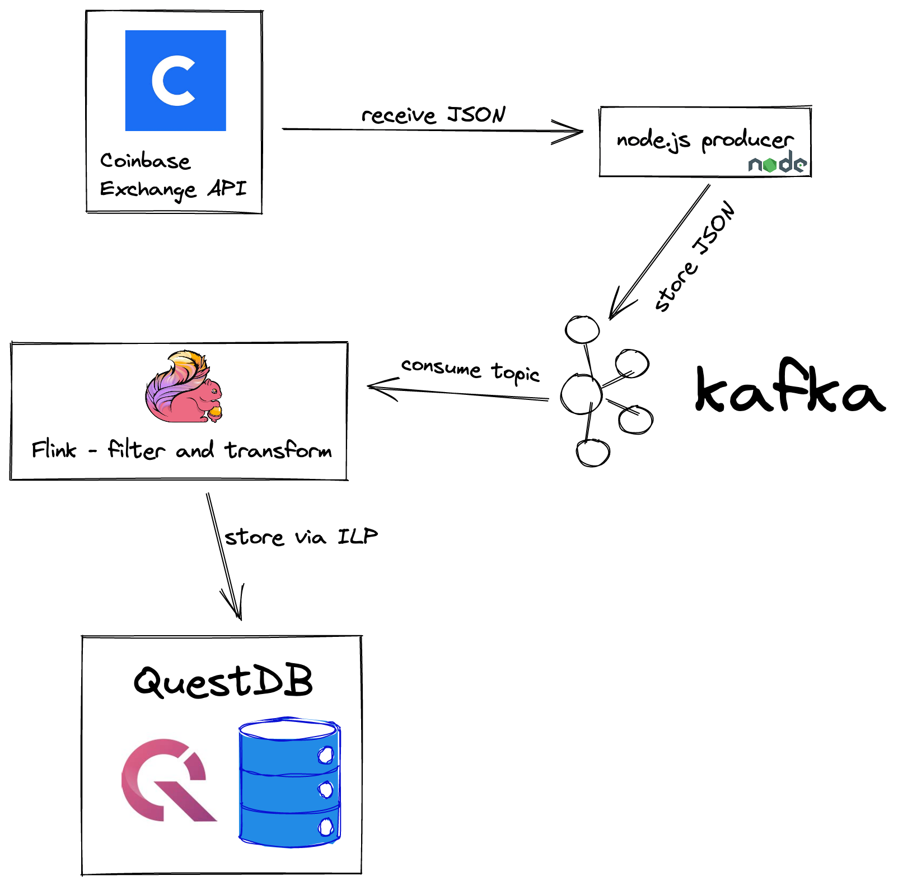

# Sample project with Flink QuestDB connector
## What does the sample project do?
The project uses Coinbase API to fetch live orders and store them in QuestDB where the orders can be analyzed further. 

The application is packaged as Docker containers thus it can run locally on most platforms.

## Prerequisites:
- Git
- Working Docker environment, including docker-compose
- Internet access to download dependencies and to receive market data from Coinbase

The project was tested on MacOS with M1, but it should work on other platforms too. Please [open a new issue](https://github.com/questdb/flink-questdb-connector/issues/new) if it's not working for you.

## Usage:
- Clone this repository via `git clone https://github.com/questdb/flink-questdb-connector.git`
- `cd flink-questdb-connector/samples/coinbase-to-kafka-to-questdb` to enter the directory with this sample.
- Run `docker-compose build` to build a docker image with the sample project.
- Run `docker-compose up` to start both Flink and QuestDB containers.
- The previous command will generate a lot of log messages. Eventually logging should cease. This means both Apache Flink and QuestDB are running.
- Go to the [Flink console](http://localhost:8082/#/job/running) and you should see one job running.
- Go to the [QuestDB console](http://localhost:19000) and run `select * from orders` and you should see some rows.
- Congratulations, the connector is working!
- You can play with the [application](src/main/java/org/questdb/flink/KafkaToQuestDB.java) source code to change behaviour. See [Flink Table API documentation](https://nightlies.apache.org/flink/flink-docs-release-1.15/docs/dev/table/tableapi/) for more information. 

## What is it good for?
You can run analytical queries to get additional insight into order data. 
For example this query will show you all BUY orders with a price set to 1 USD.
```sql
select timestamp, price, volume, count() from orders
where price = 1 and side = 'buy'
sample by 1m ALIGN to CALENDAR;
```
At that time I'm writing this there is roughly 1 BUY order every 10s with a price set to $1. I'm not quite sure what's
the motivation behind such orders, but I find it quite interesting.

You can run more practical queries, have a look at [QuestDB documentation](https://questdb.io/docs/concept/sql-execution-order) for some inspiration.

## How does it work:
The application is split into 2 parts.
1. Coinbase -> Kafka
2. Kafka -> QuestDB




The first part is a [small node.js application](../producer/index.js). It does nothing else but connect to the Exchange API, subscribe to a bunch of channels and then store all incoming JSON data into a Kafka topic.

The 2nd part is more interesting. It uses Apache Flink for data filtering, transformations and ingestion to QuestDB. The [sample program combines](src/main/java/org/questdb/flink/KafkaToQuestDB.java) Table API and SQL to interact with Flink. The program has 3 parts:
1. Define Kafka table
2. Define QuestDB table
3. Data pipeline to move data from Kafka to Quest

Table definitions are rather trivial (TODO: Why watermarks don't work?) this we focus on the data pipeline as it's doing
a bit more than just moving data from Kafka to Quest. But before diving into the code let's look at JSON data we receive
from the exchange.

This is how a simple order update looks like:
```json
{
  "type": "l2update",
  "product_id": "BTC-USD",
  "changes": [
    [
      "buy",
      "20994.53",
      "0.03931200"
    ]
  ],
  "time": "2022-09-09T11:38:11.480952Z"
}
```
It looks trivial, but it is not. Pay attention to the `changes` field. There is an array of array. In the message above the outer array has just a single element - another array. But the message could also look like this:
```json
{
  "type": "l2update",
  "product_id": "BTC-USD",
  "changes": [
    [
      "buy",
      "20994.53",
      "0.03931200"
    ],
    [
      "buy",
      "20941.12",
      "0.01245100"
    ]
  ],
  "time": "2022-09-09T11:38:11.480952Z"
}
```
In this case the outer array has multiple inner arrays. QuestDB does not support arrays. We need to rid off the array before sending the data to QuestDB. In turns out Apache Flink has a good support for this case: It has a function `UNNEST()` which expands array elements into rows. Then it's enough to use `CROSS JOIN` to connect expanded rows from array with the original table again.

Consider this example. Let's have a table `fruits` which looks as follows:

| Fruit     | Price     | Parts              |
|-----------|-----------|--------------------|
| Apple     | 1.99      | [seed, pulp, skin] |
| Raspbeery | 1.89  | [pulp, seeds]      |

The table with 3 columns: 
1. Fruit - string
2. Price - String
3. Parts - array of string.
The table has 2 rows.

We can use the UNNEST() function to unpack the arrays:
```sql
SELECT fruit, price, part
FROM fruits
CROSS JOIN UNNEST(fruits.parts) (part)
```
The result of this query would look like this:

| Fruit     | Price     | Part         |
|-----------|-----------|--------------|
| Apple     | 1.99      | seed         |
| Apple     | 1.99      | pulp         |
| Apple     | 1.99      | skin         |
| Raspbeery | 1.89  | pulp |
| Raspbeery | 1.89  | seeds |

It transforms an array into additional rows. In the pipeline this is expressed as this:
```sql
SELECT product_id, 
       changeTable.change[1] as side, 
       changeTable.change[2] as price, 
       changeTable.change[3] as volume
       ts
FROM ticks
CROSS JOIN UNNEST(ticks.changes) AS changeTable (change)
```
It transforms the outer array into rows, cross-joins them with the original table and then use Flink array operators to extract the inner array.

There is another complication: Our Kafka topic contains more than these updates. We also receive other kinds of messages
from Coinbase. This mimic a real-world situation where Kafka is use as a backbone for all data in a company and our
Flink application is just one of many consumers and have a little say on the content of the topic. Here is an example
of such message:
```json
{
  "type": "ticker",
  "sequence": 45041380791,
  "product_id": "BTC-USD",
  "price": "20995.9",
  "open_24h": "19312.1",
  "volume_24h": "31442.38277446",
  "low_24h": "19014.43",
  "high_24h": "21192.09",
  "volume_30d": "709000.13313165",
  "best_bid": "20993.74",
  "best_ask": "20997.23",
  "side": "buy",
  "time": "2022-09-09T11:38:10.887937Z",
  "trade_id": 408344927,
  "last_size": "0.47628368"
}
```
We want to ignore all messages which do not have a type set as `l2update`. SQL `WHERE` clause comes to the rescue. The SQL looks like this:
```sql
SELECT product_id , changeTable.change[1] as side, changeTable.change[2] as price, changeTable.change[3] as volume, ts
FROM ticks
CROSS JOIN UNNEST(ticks.changes) AS changeTable (change)
WHERE type = 'l2update';
```
This only selects the `l2update` messages - the only message type we want to feed into QuestDB. The last missing bit is
to INSERT the matching message into QuestDB. That's as easy as prepending the SELECT with `INSERT into <tableName>`
this the final SQL looks like this:
``sql
INSERT INTO Quest
SELECT product_id , changeTable.change[1] as side, changeTable.change[2] as price, changeTable.change[3] as volume, ts
FROM ticks
CROSS JOIN UNNEST(ticks.changes) AS changeTable (change)
WHERE type = 'l2update';
``
And that's all!
