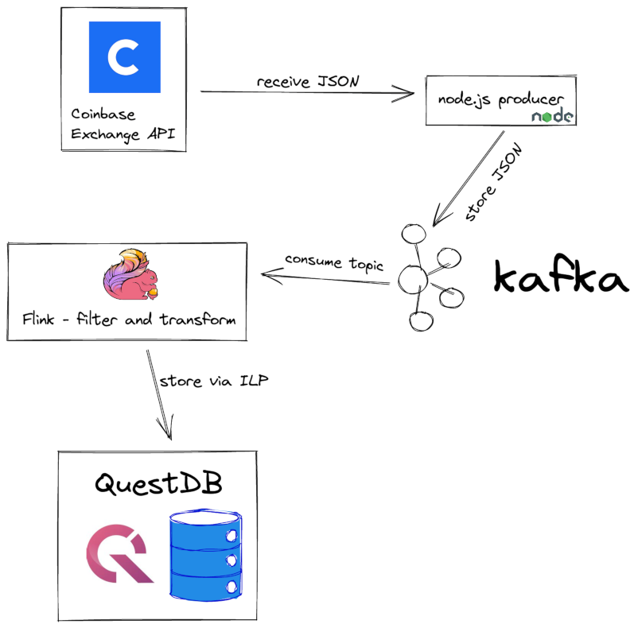

# Sample project with Flink QuestDB connector
## What does the sample project do?
The project uses Coinbase API to fetch live orders and store them in QuestDB where the orders can be analyzed further. Technicaly, it's split into 2 parts.
1. Coinbase -> Kafka
2. Kafka -> QuestDB 

The first part is a small node.js application. It does nothing else but connect to the Exchange API, subscribe to a bunch of channels and then store all incoming JSON data into a Kafka topic. 

The 2nd part is more interesting. It uses Apache Flink for data filtering, transformations and ingestion to QuestDB. 

The application is packaged as Docker containers thus it can run locally on most platforms.

## Prerequisites:
- Git
- Working Docker environment, including docker-compose
- Internet access to download dependencies and to receive market data from Coinbase

The project was tested on MacOS with M1, but it should work on other platforms too. Please [open a new issue](https://github.com/questdb/flink-questdb-connector/issues/new) if it's not working for you.

## Usage:
- Clone this repository via `git clone https://github.com/questdb/flink-questdb-connector.git`
- `cd flink-questdb-connector/samples/coinbase-to-kafka-to-questdb` to enter the directory with this sample.
- Run `docker-compose build` to build a docker image with the sample project.
- Run `docker-compose up` to start both Flink and QuestDB containers.
- The previous command will generate a lot of log messages. Eventually logging should cease. This means both Apache Flink and QuestDB are running.
- Go to the [Flink console](http://localhost:8082/#/job/running) and you should see one job running.
- Go to the [QuestDB console](http://localhost:19000) and run `select * from orders` and you should see some rows.
- Congratulations, the connector is working!
- You can play with the [application](src/main/java/org/questdb/flink/KafkaToQuestDB.java) source code to change behaviour. See [Flink Table API documentation](https://nightlies.apache.org/flink/flink-docs-release-1.15/docs/dev/table/tableapi/) for more information. 